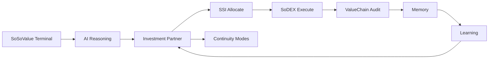

# HEIRLOCK

**The AI Financial Operating System built on SoSoValue.**

HEIRLOCK connects Terminal intelligence, Investment Partner reasoning, SSI allocation, SoDEX execution, and ValueChain continuity into one cited, non-custodial wealth loop. Your wallet always signs. The Partner remembers every thesis and learns from every outcome.

| Surface | URL |
|---------|-----|
| App | https://getheirlock.vercel.app |
| API | https://heirlock-api.onrender.com |
| Partner | https://getheirlock.vercel.app/app/living |
| Skills | https://getheirlock.vercel.app/app/skills |
| Status | https://getheirlock.vercel.app/status |

---

## Vision

Wealth management today is fragmented: research in one tab, execution in another, policy in a spreadsheet, continuity in a lawyer's drawer. HEIRLOCK unifies the SoSoValue stack into a single operating system where every decision is cited from live evidence, every trade is signed by the user, and every outcome feeds back into Investment Memory.

**One sentence:** *It kept thinking while you were away — re-scores your theses, debates itself, and only lets you approve after Continuity and the Moderator agree.*

---

## Product story



1. **Terminal** — ETF flows, news, macro from SoSoValue OpenAPI  
2. **AI reasoning** — tool-cited Partner with structured evidence  
3. **Investment Partner** — brief, debate, theses, decisions  
4. **SSI** — index analytics; mint/stake on official SSI app  
5. **SoDEX** — per-user EIP-712 relay, fill proof  
6. **ValueChain** — WealthPolicy, ActionLog, AttestationRegistry  
7. **Memory** — theses, timeline, HIT / STOP / DRIFT learning  
8. **Continuity** — Alive → Guardian → Heir  
9. **Execution** — user-signed orders under policy cap  

---

## Architecture

```
┌─────────────────────────────────────────────────────────────┐
│  Frontend (TanStack Start · React · wagmi/viem)             │
│  Partner · Wealth · Continuity · Skills · Partner Chat       │
└───────────────────────────┬─────────────────────────────────┘
                            │ SIWE JWT
┌───────────────────────────▼─────────────────────────────────┐
│  API (Fastify · Prisma · Redis)                             │
│  Skills OS · Permission Kernel · Living Loop · Partner      │
│  MCP manifest · AI tool-calling · Cron pulse                │
└─────┬─────────┬─────────┬─────────┬─────────┬─────────────┘
      │         │         │         │         │
  SoSoValue   SoDEX      SSI      ValueChain  Supabase
  Terminal    relay    (Base)    contracts    Postgres
```

### Stack

| Layer | Technology |
|-------|------------|
| Frontend | TanStack Router/Query, React 19, Tailwind v4, wagmi, viem |
| API | Fastify, Zod, Prisma, Redis |
| AI | Multi-provider chain (`@heirlock/ai-provider`), structured tools |
| Database | PostgreSQL (Supabase) |
| Contracts | Foundry, Solidity 0.8.24, ValueChain EVM |
| Auth | SIWE + JWT |

---

## AI architecture

### Investment Partner

- **Living Loop** — parallel fetch from Terminal + SSI → proposal + preflight + citations  
- **Tool-calling** — `soso_etf`, `soso_news`, `soso_macro`, `ssi_snapshot`, `sodex_portfolio`, `save_thesis`  
- **Memory injection** — theses and decisions in every system prompt  
- **Debate engine** — Counsel → Falsifier → Moderator before Approve  
- **Pulse** — background re-score while away; cached brief on open  

### Debate & learning

| Agent | Role |
|-------|------|
| Counsel | Defends proposal from live evidence |
| Falsifier | Attacks weak theses |
| Moderator | APPROVE \| CHALLENGE \| WAIT |
| Learning | HIT / STOP / DRIFT from fills and outcomes |

---

## Skills architecture

Install Skills → build your Financial OS. Each Skill is a permissioned capability bundle.

| Skill | Purpose |
|-------|---------|
| Family Office | Flagship Living Loop orchestrator |
| Research | Terminal synthesis |
| Macro | Calendar and event correlation |
| ETF | Flow history and drift |
| Portfolio | SoDEX + SSI holdings |
| Risk | Policy and preflight |
| SSI | Index analytics + Base contracts |
| Execution | SoDEX relay |
| Guardian | Risk-off continuity |
| Treasury | Stable sleeve management |
| Market Monitor | Pulse and snapshots |
| News | Hot news ingestion |
| Alert | Falsify and gate alerts |
| Memory | Theses and learning |
| Continuity | ValueChain modes |

Catalog: [`skills/`](skills/) — each Skill has a production `SKILL.md` with schema, tools, and examples.

API: `GET /api/skills`, `POST /api/skills/:id/enable`, `GET /api/skills/tools`

---

## MCP architecture

HEIRLOCK exposes a production MCP-compatible tool surface for external agents.

| Endpoint | Description |
|----------|-------------|
| `GET /api/mcp/manifest` | Tool discovery (name, schema, auth) |
| `GET /api/mcp/tools` | Full tool metadata |
| `POST /api/mcp/call` | Invoke tool (`{ name, arguments }`) |

**Public tools:** `soso_etf_summary`, `soso_news_hot`, `soso_macro_calendar`, `ssi_index_snapshot`, `ssi_constituents`, `sodex_markets_tickers`

**Wallet tools (Bearer JWT):** `sodex_portfolio`, `partner_brief`, `partner_memory`, `partner_living_loop`, `partner_evidence_graph`, `policy_continuity_gate`

Authentication: SIWE via `POST /api/auth/verify`, then `Authorization: Bearer <token>`.

---

## Smart contracts (ValueChain)

Deployed on ValueChain testnet (138565) and mainnet (286623):

| Contract | Role |
|----------|------|
| WealthPolicy | Mode, notional cap, controller |
| ModeController | Guardian / Heir transitions |
| ActionLog | Append-only evidence anchors |
| AttestationRegistry | Off-chain attestation hashes |
| ContinuityNFT | Soulbound continuity marker |
| FeeCollector | Protocol fees |

Artifacts: `contracts/deployments/valuechain-{testnet,mainnet}.json`  
API: `GET /api/contracts`

---

## Database (Prisma)

Key models: `UserProfile`, `WealthPolicy`, `InvestmentThesis`, `InvestmentDecision`, `SignedOrder`, `Trade`, `MarketSnapshot`, `AgentLog`, `SkillEvent`, `ActionLogRef`, `Attestation`

Schema: `apps/api/prisma/schema.prisma`

---

## API overview

| Prefix | Purpose |
|--------|---------|
| `/api/auth/*` | SIWE nonce, verify, me |
| `/api/soso/*` | SoSoValue Terminal proxy |
| `/api/ssi/*` | SSI index analytics |
| `/api/sodex/*` | Markets, verify, relay, portfolio |
| `/api/fo/*` | Living Loop, Partner, AI chat |
| `/api/skills/*` | Skill registry |
| `/api/mcp/*` | MCP tool surface |
| `/api/contracts` | ValueChain addresses |
| `/api/health` | Liveness and dependency checks |

---

## Installation

### Prerequisites

- Node.js 20+
- pnpm or npm
- PostgreSQL (or Supabase)
- Redis (optional, recommended)

### Clone and install

```bash
git clone https://github.com/goat-dev8/HEIRLOCK.git
cd HEIRLOCK
pnpm install
```

### Environment

Copy `.env.example` to `.env` and configure:

- `DATABASE_URL`, `DIRECT_DATABASE_URL`
- `JWT_SECRET`, `SIWE_DOMAIN`
- `SOSOVALUE_API_KEY`
- `AI_PRIMARY_PROVIDER` + provider keys
- `SODEX_*` gateway URLs
- `CORS_ALLOWED_ORIGINS`

See `packages/config` for the full schema.

### Database

```bash
cd apps/api
pnpm prisma migrate deploy
pnpm prisma generate
```

### Development

```bash
# API (port 10000)
pnpm --filter @heirlock/api dev

# Frontend (port 8080)
pnpm --filter @heirlock/frontend dev
```

---

## Deployment

| Service | Platform |
|---------|----------|
| API | Render (`heirlock-api.onrender.com`) |
| Web | Vercel (`getheirlock.vercel.app`) |
| Database | Supabase Postgres |

Cron: `POST /api/cron/partner-pulse` with `CRON_SECRET`

---

## Security

- **Non-custodial** — HEIRLOCK never holds private keys  
- **SIWE + JWT** — wallet-bound sessions  
- **Policy gates** — notional caps, mode checks, debate before Approve  
- **Rate limiting** — 120 req/min default  
- **Fill proof** — trades + balance reconciliation  

---

## Project structure

```
HEIRLOCK/
├── apps/api/          Fastify API, FO agents, MCP, Prisma
├── frontend/          TanStack Start app
├── contracts/         Foundry + ValueChain deployments
├── packages/          config, ai-provider
├── skills/            Production Skill catalog (SKILL.md)
└── README.md
```

---

## Features

- Living Investment Partner with daily brief  
- Floating Partner chat (brain launcher, cited suggestions)  
- Adversarial debate before approval  
- Investment Memory (theses, decisions, learning)  
- Non-custodial SoDEX EIP-712 relay  
- SSI dual-source drift (Terminal vs on-chain)  
- ValueChain continuity modes  
- 15+ production Skills  
- 12 MCP tools for external agents  
- Public status page  

---

## License

Private — All rights reserved.
